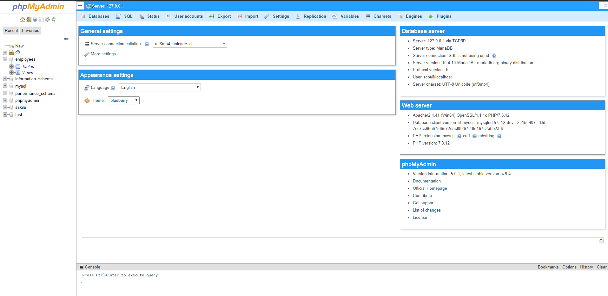

# PHPMyAdmin v5.x - BlueBerry Theme
### Customized phpMyAdmin theme with clean Materialized design for phpmyadmin version 5.0.0 and whole series of version 5.x.

## Installation
1. Copy/Download/Clone [Latest Release](https://github.com/piyushdolar/phpmyadmin-blueberry-theme/releases/tag/v1.5.0) the repository to your system
2. Add the whole folder to your `phpMyAdmin/themes` directory which is located under `wamp/xampp` directory.
3. Open your phpmyadmin in browser
4. Go to homepage
5. Change the theme to BlueBerry.
6. Done!

## Screenshots

## Changelogs:
### v1.5.0 - 17/02/2020
- Dashboard updated.
- Responsive fixed.
- Minor design and CSS changes.

### v1.2.4 - 13/02/2020
- Material icons added.
- Dashboard updated.

### v1.1.9 - 12/02/2020
- Beta released.

_Open the issue ticket if you have any questions regarding the themes or want any updates._
